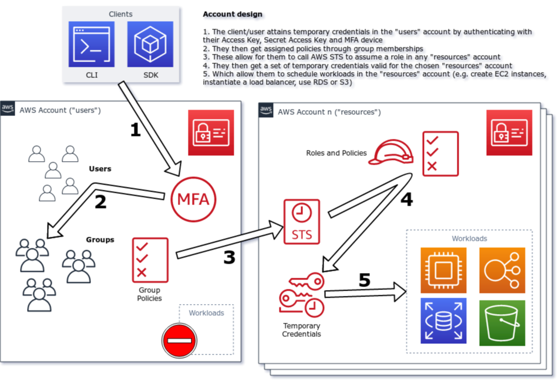
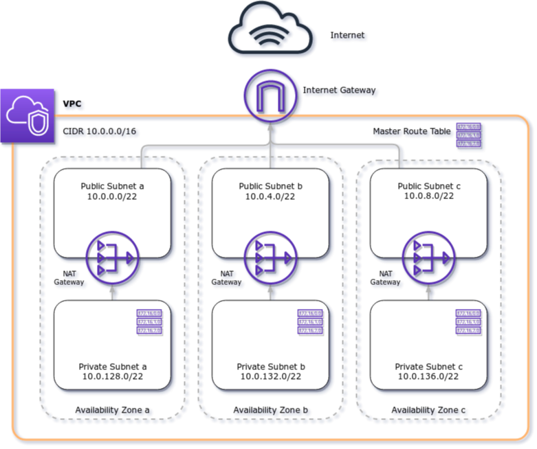

# AWS Core Modules

This is a collection of Terraform "core" modules I would consider to be building blocks of every reasonable AWS account setup.

## Available modules
- [config](#config)
- [iam-users](#iam-users)
- [iam-resources](#iam-resources)
- [vpc](#vpc)

## `config`

The module configures AWS Config to monitor your account for non-compliant resources for the following checks:

- **INSTANCES_IN_VPC**: All instances need to be started in a VPC (the default since years)
- **EC2_VOLUME_INUSE_CHECK**: All volumes need to be attached (otherwise they cost money for nothing)
- **EIP_ATTACHED**: All EIPs need to be attached (otherwise they cost money)
- **ENCRYPTED_VOLUMES**: All volumes in the account need to be encrypted
- **INCOMING_SSH_DISABLED**: No Security Group has port 22 open to the world
- **CLOUD_TRAIL_ENABLED**: CloudTrail is enabled in the account
- **CLOUDWATCH_ALARM_ACTION_CHECK**: You need to at least have an action for the state "Alarm" defined
- **IAM_GROUP_HAS_USERS_CHECK**: Every group in IAM needs to have users attached to it
- **IAM_PASSWORD_POLICY**: Account needs to have a password policy, with a certain complexity and it has to be enforced
- **IAM_USER_GROUP_MEMBERSHIP_CHECK**: A list of groups IAM users have to be a part of
- **IAM_USER_NO_POLICIES_CHECK**: None of your users should have policies attached to them directly, use groups/roles for that
- **ROOT_ACCOUNT_MFA_ENABLED**: Your root account needs to have MFA enabled
- **S3_BUCKET_PUBLIC_READ_PROHIBITED**: S3 buckets shouldn't be open to the public
- **S3_BUCKET_PUBLIC_WRITE_PROHIBITED**: S3 buckets shouldn't be publicly writable
- **S3_BUCKET_SSL_REQUESTS_ONLY**: S3 buckets must only allow TLS traffic (through bucket policies)
- **S3_BUCKET_SERVER_SIDE_ENCRYPTION_ENABLED**: S3 buckets must have SSE enabled
- **S3_BUCKET_VERSIONING_ENABLED**: S3 bucket versioning has to be enabled
- **EBS_OPTIMIZED_INSTANCE**: All instances run on EBS-optimized storage
- **ACCESS_KEYS_ROTATED**: All your access keys need to be rotated after a certain while
- **APPROVED_AMIS_BY_TAG**: Only allow AMIs with a certain tag for EC2 instances
- **AUTOSCALING_GROUP_ELB_HEALTHCHECK_REQUIRED**: AutoScalingGroups must be attached to an LB and have health checks enabled
- **DESIRED_INSTANCE_TYPE**: Only allow for certain instance types to be used
- **RDS_INSTANCE_PUBLIC_ACCESS_CHECK**: RDS instances must not be publicly accessible
- **RDS_SNAPSHOTS_PUBLIC_PROHIBITED**: RDS snapshots must not be public
- **IAM_POLICY_NO_STATEMENTS_WITH_ADMIN_ACCESS**: None of your policies allow for administrative privilege escalation
- **IAM_ROOT_ACCESS_KEY_CHECK**: Your root account must not have any security credentials attached to it

Some of them can receive extra parameters. See a table reference below.

### Example

Add the following statement to your `variables.tf` to use the `config` module in version `v0.3.8`:

```terraform
module "aws_config" {
  source = "git::https://github.com/moritzheiber/terraform-aws-core-modules.git//config?ref=v0.3.8"

  # Optional, defaults to "aws-config"
  bucket_prefix = "my-aws-config-bucket"
  # Optional, you should disable it for testing purposes, otherwise you will have trouble removing the S3 bucket again
  enable_lifecycle_management_for_s3 = false
}
```

and run `terraform init` to download the required module files.

### Prerequisites
* Terraform (`>= 0.12.4`)
* `aws` provider (`>= 2.20.0`)

### Input Variables
| Variable | Type | Default | Description |
|----------|------|---------|-------------|
| **`amis_by_tag_key_and_value_list`** | list(string) | `[]` | Required AMI tags for EC2 instances |
| **`bucket_account_id`** | string | `""` | The AWS account ID the S3 bucket lives in that AWS Config is writing its records to. Defaults to the ID of the current account |
| **`bucket_key_prefix`** | string | `"aws_config"` | The prefix of the keys AWS Config writes to |
| **`bucket_prefix`** | string | `"aws-config"` | The prefix for the S3 bucket AWS Config Recorder writes to |
| **`config_delivery_channel_name`** | string | `"config"` | The name of the delivery channel for AWS Config |
| **`config_recorder_name`** | string | `"config"` | The name of the recorder for AWS Config |
| **`delivery_frequency`** | string | `"Three_Hours"` | The frequency at which AWS Config delivers its recorded findings to S3 |
| **`desired_instance_types`** | set(string) | `[]` | A string of comma-delimited instance types |
| **`enable_lifecycle_management_for_s3`** | bool | `true` | Whether or not to enable lifecycle management for the S3 bucket AWS Config writes to |
| **`iam_role_name`** | string | `"config"` | The name of the IAM role created for delegating permissions to AWS Config |
| **`iam_user_groups`** | list(string) | `[]` | A list of mandatory groups for IAM users |
| **`max_access_key_age`** | string | `"90"` | The maximum amount of days an access key can live without being rotated |
| **`password_policy`** | map(string) | `{}` | A map of values describing the password policy parameters AWS Config is looking for |
| **`s3_kms_sse_encryption_key_arn`** | string | `""` | The ARN for the KMS key to use for S3 server-side bucket encryption |
## `iam-users`

A module to configure the "users" account modeled after a common security principle of separating users from resource accounts through a MFA-enabled role-assumption bridge:



This is modeled after a strict separation of privilege, as explained in [an article I wrote a while ago](https://www.thoughtworks.com/insights/blog/using-aws-security-first-class-citizen).

Usually you will want to use this module together with [`iam-resources`](#iam-resources) module.

### Example

```terraform
module "iam_users" {
  source            = "git::https://github.com/moritzheiber/terraform-aws-core-modules.git//iam-users?ref=v0.3.8"
  iam_account_alias = "my_unique_alias"
}
```

### Prerequisites
* Terraform (`>= 0.12.4`)
* `aws` provider (`~> 2.20.0`)

### Input Variables
| Variable | Type | Default | Description |
|----------|------|---------|-------------|
| **`admin_group_name`** | string | `"admins"` | Administrator group name |
| **`iam_account_alias`** | string | (required) | A globally unique identifier, human-readable for your AWS account |
| **`multi_factor_auth_age`** | string | `"14400"` | The amount of time (in seconds) for a user session to be valid |
| **`password_policy`** | map(string) | `{}` | A map of password policy parameters you want to set differently from the defaults |
| **`resource_admin_role_name`** | string | `"resource-admin"` | The name of the administrator role one is supposed to assume in the resource account |
| **`resource_user_role_name`** | string | `"resource-user"` | The name of the user role one is supposed to assume in the resource account |
| **`resources_account_id`** | string | `""` | The account ID of the AWS account you want to start resources in |
| **`set_iam_account_alias`** | bool | `true` | Whether or not to set the account alias (useful to set to false when iam-users and iam-resources module are being deployed into the same account) |
| **`user_group_name`** | string | `"users"` | User group name |
### Output Values
| Variable | Description |
|----------|-------------|
| **``admin_group_name``** | The name of the admin group |
| **``user_group_name``** | The name of the user group |
## `iam-resources`

A module to configure the "resources" account modeled after a common security principle of separating users from resource accounts through a MFA-enabled role-assumption bridge.

### Example

```terraform
module "iam_resources" {
  source            = "git::https://github.com/moritzheiber/terraform-aws-core-modules.git//iam-resources?ref=v0.3.8"
  iam_account_alias = "my_unique_alias"
}

```

### Prerequisites
* Terraform (`>= 0.12.4`)
* `aws` provider (`~> 2.20.0`)

### Input Variables
| Variable | Type | Default | Description |
|----------|------|---------|-------------|
| **`admin_access_role_name`** | string | `"resource-admin"` | Name of the admin role |
| **`admin_multi_factor_auth_age`** | string | `"3600"` | The amount of time (in seconds) for a admin session to be valid |
| **`iam_account_alias`** | string | (required) | A globally unique identifier, human-readable for your AWS account |
| **`set_iam_account_alias`** | bool | `true` | Whether or not to set the account alias (useful to set to false when iam-users and iam-resources module are being deployed into the same account) |
| **`user_access_role_name`** | string | `"resource-user"` | Name of the user role |
| **`user_multi_factor_auth_age`** | string | `"14400"` | The amount of time (in seconds) for a user session to be valid |
| **`users_account_id`** | string | `""` | The account ID of where the users are living in |
### Output Values
| Variable | Description |
|----------|-------------|
| **``admin_access_role_name``** | The name of the role users are able to assume to attain admin privileges |
| **``user_access_role_name``** | The name of the role users are able to assume to attain user privileges |
## `vpc`

The module builds a VPC with the default CIDR range of `10.0.0.0/16`, three subnets a "public" configuration (attached and routed to an AWS Internet Gateway) and three subnets in a "private" configuration (attached and routed through three separate AWS NAT Gateways):



### Example

Add the following statement to your `variables.tf` to use the `vpc` module in version `v0.3.8`:

```terraform
module "core_vpc" {
  source = "git::https://github.com/moritzheiber/terraform-aws-core-modules.git//vpc?ref=v0.3.8"

  tags = {
    Resource    = "my_team_name"
    Cost_Center = "my_billing_tag"
  }
}
```

and run `terraform init` to download the required module files.

All created **subnets will have a tag created for them which specifies their scope** (i.e. "public" for public subnets and "private" for private subnets) which you can filter on using Terraform data sources:

```terraform
data "aws_vpc" "core" {
tags = {
    # `core_vpc` is the default, the variable is `vpc_name`
    Name = "core_vpc"
  }
}

data "aws_subnet_ids" "public" {
  vpc_id = data.aws_vpc.core.id

  tags = {
    Scope = "public"
  }
}

data "aws_subnet_ids" "private" {
  vpc_id = data.aws_vpc.core.id

  tags = {
    Scope = "private"
  }
}
```

The result is a list of subnet IDs you can use to create other resources such as Elastic Load Balancers or AutoScalingGroups.

### Prerequisites
* Terraform (`>= 0.12.4`)
* `aws` provider (`~> 2.20.0`)

### Input Variables
| Variable | Type | Default | Description |
|----------|------|---------|-------------|
| **`enable_dns_hostnames`** | bool | `true` | Whether or not to enable VPC DNS hostname support |
| **`enable_dns_support`** | bool | `true` | Whether or not to enable VPC DNS support |
| **`private_subnet_cidrs`** | list(string) | `[]` | A list of CIDRs for the private subnets. Needs to be the same amount as subnets in the Availability Zone you are deploying into (probably 3) |
| **`private_subnet_offset`** | number | `32` | The amount of IP space between the public and the private subnet |
| **`private_subnet_prefix`** | string | `""` | The prefix to attach to the name of the private subnets |
| **`private_subnet_size`** | number | `6` | The size of the private subnet (default: 1022 usable addresses) |
| **`public_subnet_cidrs`** | list(string) | `[]` | A list of CIDRs for the public subnets. Needs to be the same amount as subnets in the Availability Zone you are deploying into (probably 3) |
| **`public_subnet_prefix`** | string | `""` | The prefix to attach to the name of the public subnets |
| **`public_subnet_size`** | number | `"6"` | The size of the public subnet (default: 1022 usable addresses) |
| **`tags`** | map(string) | `{}` | A map of tags to apply to all VPC resources |
| **`vpc_cidr_range`** | string | `"10.0.0.0/16"` | The IP address space to use for the VPC |
| **`vpc_name`** | string | `"core_vpc"` | The name of the VPC |
### Output Values
| Variable | Description |
|----------|-------------|
| **``private_subnet_ids``** | A list of private subnet IDs |
| **``public_subnet_ids``** | A list of public subnet IDs |
| **``vpc_id``** | The ID of the created VPC |
